# :material-plex:

## **How to set up a Plex Client**

This guide will assist you in setting up your **Plex User Account**, as well as how to properly configure your **Media Player(s)**.

---

### **Joining a server**

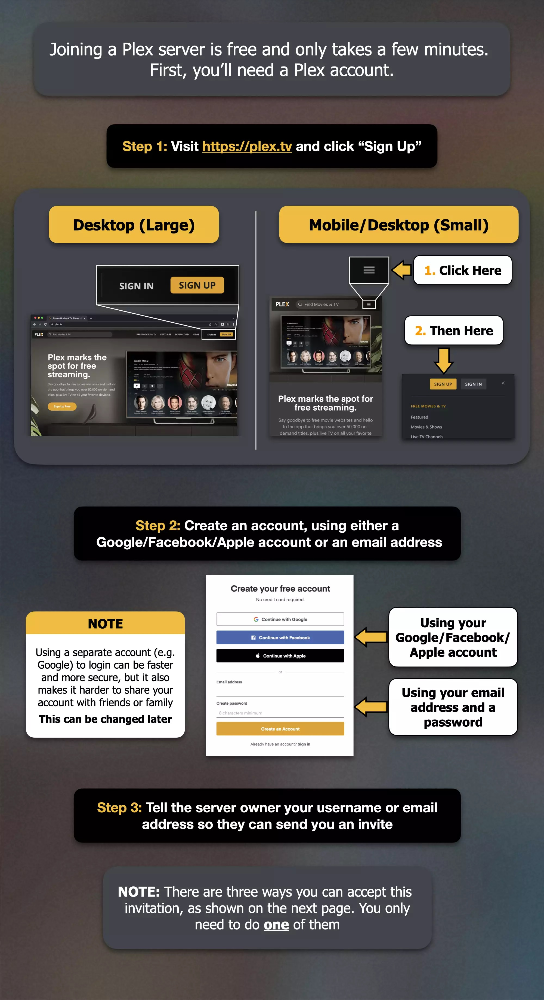
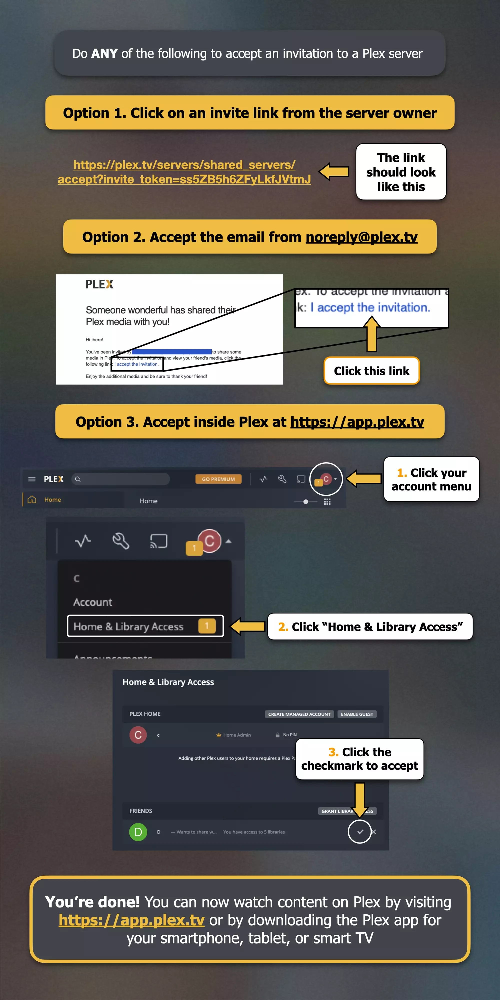

### **Unsubscribe from the Plex newsletter**

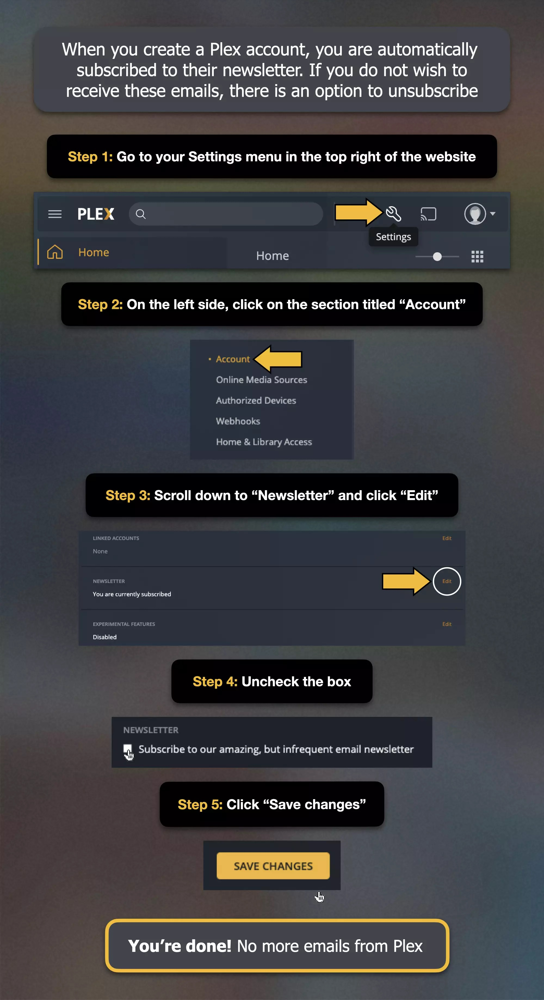

#

### **Pinning Libraries**

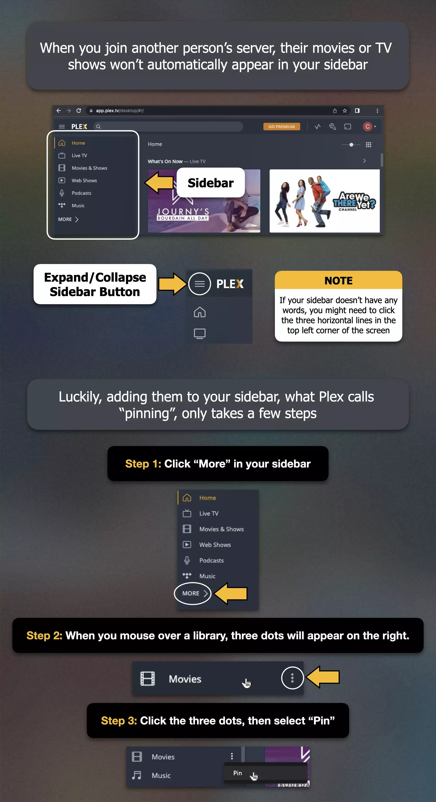
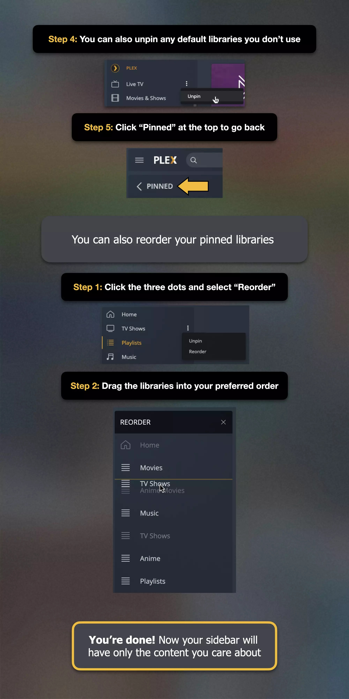

#

### **Configuring Video Quality**

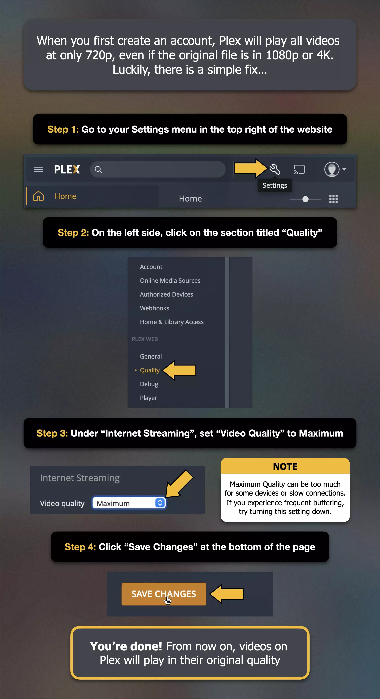

#

### **Disabling the pre-configured online media sources**

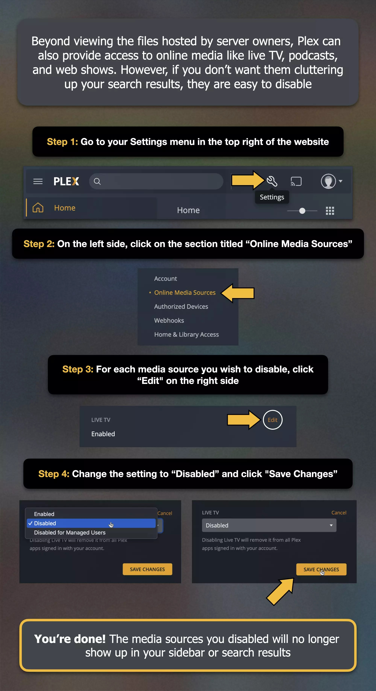

#

### **Understanding the concept of Bitrate**

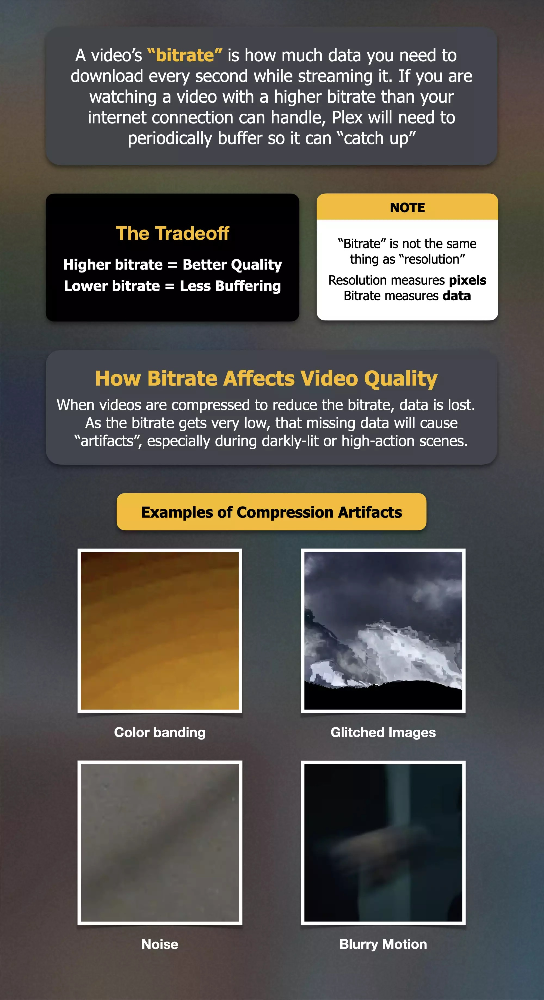

!!! Info "If you are setting up Plex at your parents house I would recommend limiting the quality based on the limitations of the network. If they have a 10Mbps network. Set the quality to maximum 8 Mbps. This will ensure they get sufficient quality while also making sure they won't get any playback issues due to slow network speeds."

#

### **Configuring Plex For Android**

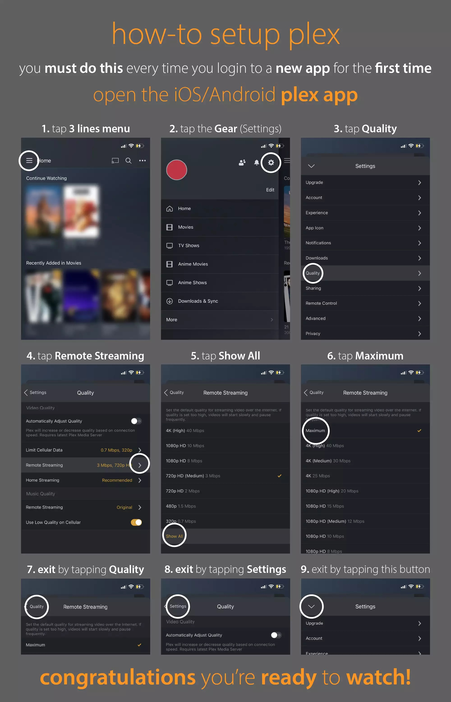

#

### **Configuring Plex For tvOS**

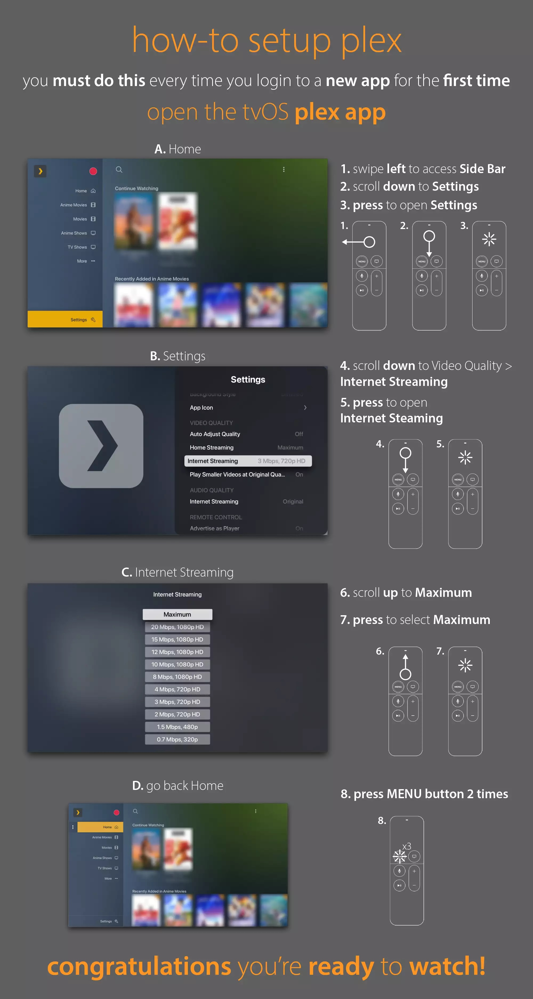

#

### **Configuring Plex For SmartTV or Video Console**

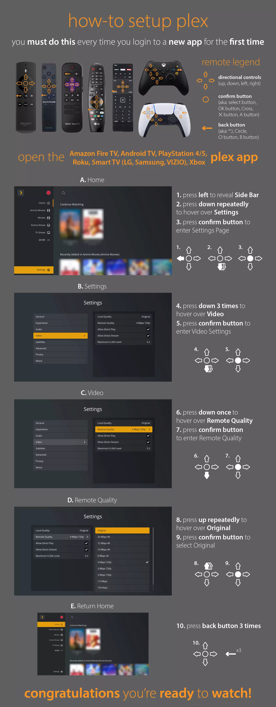

### **Request Movies or TV Series**

After gaining access to the server, head over to https://request.rognheim.no.
There you can log in with your new Plex account and request movies or tv-series which are currently not available on the server. Each user is limited to 10 movies and 10 seasons requests each month.

### **Downloads FAQ**

#

### **Can I download media without having to transcode it?**
Yes, that is generally the case.  If the device you are using can direct play a file, it can be downloaded without needing to transcode.

Not every file is guaranteed to be able to download without requiring a transcode. For instance, not every file will be capable of direct play on a device or the server might have remote streaming limitation in place (which can still apply when downloading remotely). But a wide range of content will be able to download without requiring a transcode.

#

### **Can I download content at a lower quality to save space?**
Yes.  There is a separate setting for Downloads.  These are global settings that will apply to all content you download.  If you change the setting, it will only affect content you Download in the future; existing (already downloaded) content will not be changed.

#

### **Are subtitles downloaded?**
Subtitles can be downloaded following your current subtitle burn-in option on your client.  If the stream will currently play the subtitle without needing to be burned-in to the video, they will be downloaded as they are.  If you have set your subtitles to always burn-in, then the subtitle will be burned-in prior to download and no additional subtitles will be downloaded.

!!! Info "In order to get subtitles for content at lower quality you must set `subtitle burn-in` to always. This can be activated in **Settings** -> **Advanced** -> **Subtitles** -> **Burn subtitles** -> **Always**"

#

### **Will the app continue to download media if the device goes to sleep?**
No. File transfers cannot work if the app is moved to the background such as when the screen turns off or the device goes to sleep. The app must be running in the foreground. If the app is on the “Items” tab of the “Downloads” library, the app will actively keep the device awake and continue to download media to your device.

#

### **Can I cast downloaded content to another Plex client or through Chromecast?**
Casting downloaded content to another device is currently not supported on Chromecast.