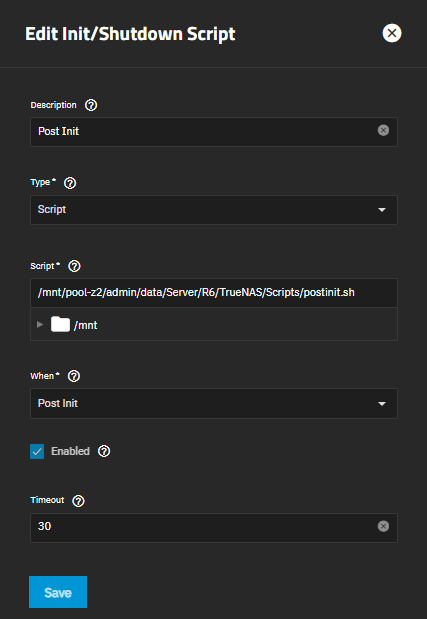

# :simple-truenas:


## **TrueNAS**

---

### **Introduction**

TrueNAS is an open-source Linux-based storage operating system that offers a reliable and scalable solution for self-hosting your network attached storage (NAS). Running TrueNAS as a virtual machine (VM) enables us to manage and consolidate our storage needs within a virtualized environment. This approach provides benefits such as easy resource allocation, simplified management, enhanced data protection, and cost-efficiency, making for a flexible self-hosting storage solution.

---

### **VM Configuration**

!!! Info "This guide assumes you are installing TrueNAS as a VM in Proxmox"

#### General:
- [x] Enable advanced settings.

#### OS:
- [x] Select your ISO image and set Guest OS to `Linux`. Version to `6.x -2.6 Kernel`

#### System:
- [x] Graphic card: **Default**
- [x] Machine: **q35**
- [x] BIOS: **OVMF (UEFI)**
- [x] Add EFI Disk
- [x] Enable **Qemu Agent**. TrueNAS comes preinstalled with the guest agent. Set the SCSI Controller to **VirtIO SCSI single**.

- Disks: Give the installation 64 GB of space. Enable **SSD emulation**. Enable **Discard** in order to enable thin provisioning. Also make sure that **IO thread** is enabled.

- CPU: Change the CPU type to **host** and give it a minimum of 4 Cores. There is no need to enable any CPU flags when using CPU type as host. The Guest VM will get complete access to the host CPU.

- Memory: I will be using ZFS on 8x 16TB disks so it will require a lot of RAM. This can be adjusted later on. I will start with 64 GB (65536 MiB) of Memory. Disable **Balooning Device**.

- Network: Leave as default.

---

!!! Danger "Secure Boot is **Enabled** by default. You will need to disable it in order to boot."

- After booting the VM, enter the BIOS via the Console from the Proxmox WebGUI 

!!! Success "BIOS -> Device Manager -> Secure Boot -> Disable secure boot."

---

### **Installation**

- Remove ISO from Hardware -> CD/DVD Drive after successful installation.

---

### **Post-install tasks**

- Passthrough the HBA card and other PCI devices (NVMe drives etc) before starting the VM. Click the VM, go to Hardware, and press Add -> PCI Device.

!!! Info "Disable ROM-Bar when passing through a HBA card. Mine gets stuck in a boot loop if I have it enabled!"

---

### **TrueNAS Settings**

- Network: Edit Interface. Disable DHCP. Add Static IP

- System Settings -> General -> GUI -> Usage collection: Disabled
- System Settings -> General -> Localization
- System Settings -> Advanced Settings -> Access -> Token Lifetime: 14400

---

### **Setting up alerts**

create/login to your google account and generate an app password

Click Alerts -> Settings -> Email

Chose SMTP

From Email: your new google account "example@gmail.com"

From Name: The name displayed on the e-mail received from the TrueNAS alerts

Outgoing Mail Server: smtp.gmail.com

Mail Server Port: 587

Security: TLS

Check SMTP Authentication

Username: "example@gmail.com"

Password: "app_password"

---

### **Setting up datasets and shares**

!!! Info "This discusses mainly setting up SMB shares on a preexisting pool."

#### General guidelines to help you design an efficient and organized layout:

Here's an example layout for a TrueNAS and ZFS system with three users, a shared Time Machine dataset, and shared backup folders:

**Example Layout**:

```shell
pool-name/
  ├── admin/
  │     ├── backups/
  │     │    ├── vm-snapshots/
  │     │    └── databases/
  │     ├── data/
  │     └── media/
  │
  ├── users/
  │    ├── user1/
  │    ├── user2/
  ├── shared-time-machine/
  │    ├── admin/
  │    ├── user1/
  │    └── user2/
  └── shared-backups/
       ├── project-backups/
       └── department-backups/
  
```

- Create a top-level dataset for users: Start by creating a top-level dataset to contain all user datasets, for example, `pool_name/users/`.

- Create individual datasets for each user: Within the top-level dataset, create a separate dataset for each user, such as `pool_name/users/user1/`, `pool_name/users/user2/`, and so on.

- Set up user permissions: Assign the appropriate permissions to each user dataset so that only the corresponding user has access. You can use ACLs (Access Control Lists) or traditional Unix permissions, depending on your environment and preference.

- Create a shared Time Machine dataset: Create a separate dataset for the shared Time Machine backups, for example, `pool_name/shared_time_machine/`. Configure the dataset properties and SMB share settings to enable Time Machine support.

- Set up per-user Time Machine sub-datasets: Within the shared Time Machine dataset, create a sub-dataset for each user, such as `pool_name/shared_time_machine/user1_backup/`, `pool_name/shared_time_machine/user2_backup/`, and so on. Assign the appropriate permissions to each sub-dataset so that only the corresponding user has access.

- Create shared backup folders: Create a separate dataset for shared backup folders, for example, `pool_name/shared_backups/`. Within this dataset, create sub-datasets for specific backup purposes and assign appropriate permissions.

- Configure user quotas and reservations: Set up quotas to limit the amount of space each user dataset can consume and set up reservations to ensure that critical user datasets always have a minimum amount of available space.

- Enable data protection features: Enable features like snapshots, replication, and backups to protect user data. Set up a regular snapshot schedule and configure replication to another ZFS pool or offsite location, if possible.

- Optimize performance: Depending on your workload, you may want to enable or disable certain ZFS features like compression and deduplication for each user dataset. Test different configurations to determine the best balance for your environment.

---

#### Configuring shares (Example of folder only visible for user_name1)

**1.** Go to Credentials -> Local Groups. Add the following groups:
    - local_admin: GID: 1000
    - local_users: GID: 3000
  
    **Enable Samba Authentication**.

**2.** Go to Credentials -> Local Users. Add the following users:
    - custom_admin: GID: 1000
    - user_name1: GID: 3000

    **Uncheck "Create New Primary Group". Enable Samba Authentication**.

**3.** Go to Datasets. First add a Dataset named users, and a sub-dataset named user_name1. Set share type to SMB. Edit ACL Permissions and change Group from builtin_users to local_users. Save Access Control List.

**4.** Go to Shares. Add share. Add the path /pool-name/users/user-name1. Set the purpose to "No preset" Go to Advanced Options and enable "Access Based Share Enumeration"

**5.** Save and go to Edit Share ACL. Add a new entry in the ACL Entries. Remove the information in the SID, typically S-1-1-0 and in the Domain write the full domain for TrueNAS, e.g truenas.internal.rognheim.no or whatever you have set it to. Add user_name1 in Name. Save. Now only user_name1 should have access and see the folder in explorer. The dataset of users/user_name1 will only be visible to the user: user_name1

!!! Info "If you want to change the user/group that have access to the share you have to remove the SID entry before saving the new user"

---

### **(Outdated) Increasing ARC and Cache Memory Allocation in TrueNAS Running on Proxmox**

Increasing the ARC cache in TrueNAS can help to maximize your use of available memory for faster disk I/O operations. This can be highly beneficial in heavy read scenarios. However, keep in mind that setting aside more RAM for ARC can limit resources for other processes, potentially causing system instability.

The default allocation of RAM to ARC is 50% in TrueNAS, and typically you'd probably want to leave that as-is because you don't want all of your memory going towards caching. The recommended maximum amount of memory to allocate to the ARC is 90% of the total memory.

There are two tunables in TrueNAS that needs to be set in order to increase the RAM used by ARC:

- `zfs_arc_max`
- `zfs_arc_sys_free`

To edit these values you can run the following script:

```shell
#!/bin/sh

PATH="/bin:/sbin:/usr/bin:/usr/sbin:${PATH}"
export PATH

ARC_PCT="90"
ARC_BYTES=$(grep '^MemTotal' /proc/meminfo | awk -v pct=${ARC_PCT} '{printf "%d", $2 * 1024 * (pct / 100.0)}')
echo ${ARC_BYTES} > /sys/module/zfs/parameters/zfs_arc_max

SYS_FREE_BYTES=$((8*1024*1024*1024))
echo ${SYS_FREE_BYTES} > /sys/module/zfs/parameters/zfs_arc_sys_free
```

This script needs to be run every time you reboot. In order to automate the script it can be added as a Post Init Script via the TrueNAS GUI: **System** -> **Advanced** -> **Init/Shutdown Scripts** -> **Add**



<!-- ---

### **Known issues**

#### -->---

### **Configuration files**

- Not documented yet or not applicable for this topic.

